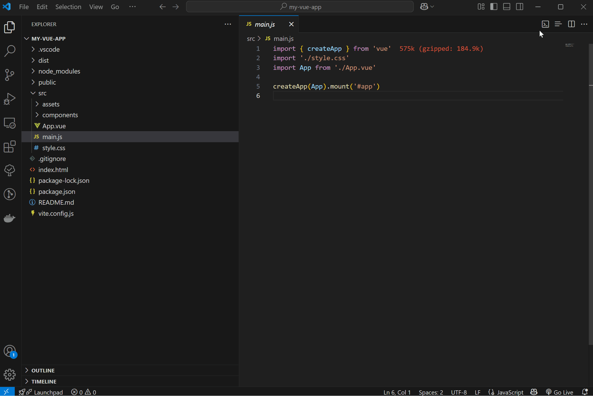
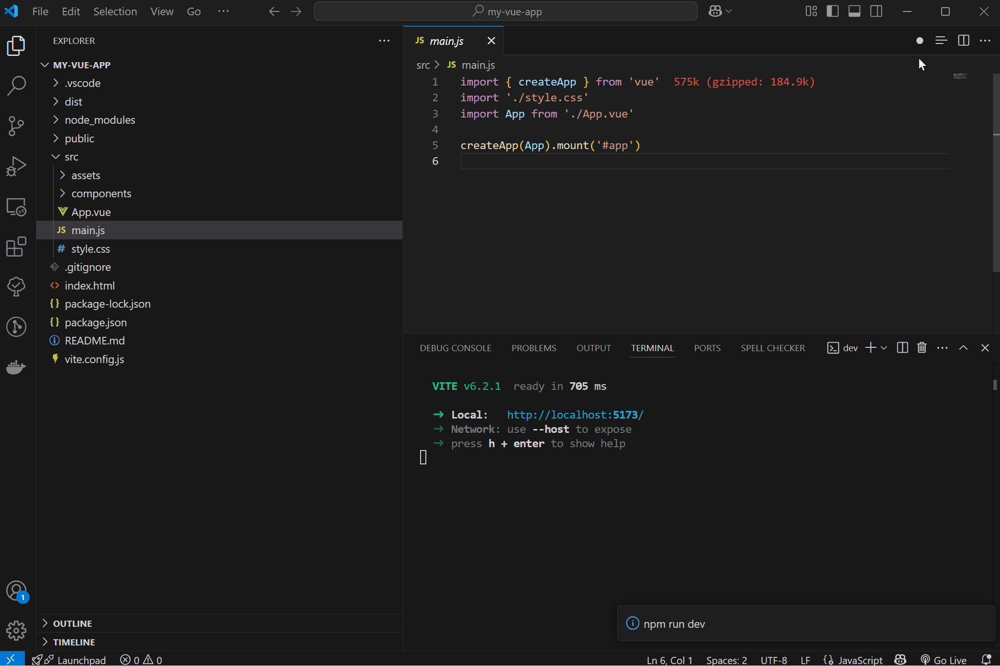
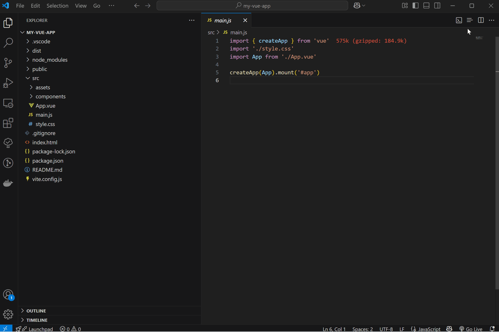

# Project Run

   


[English](https://github.com/chen-cattle/project-run/blob/dev/README.md) | [中文](https://github.com/chen-cattle/project-run/blob/dev/docs/README_CN.md)


Simplify the process of starting a javascript project in vscode and quickly start a javascript project

## Feature

Automatically scan the package.json files in the workspace and quickly start the Javascript projects in each workspace through buttons or shortcuts

* Fast Run  


* Quick Stop  


* Open the command list  


## ShortcutKey

| shortcut key | function |
| --- | --- |
| `Ctrl+Alt+P` | Start the project in the current workspace |
| `Ctrl+Alt+S` | Stop the project in the current workspace |
| `Ctrl+Alt+M` | Open the list of executable commands |


## Tips

Quick Run provides three run instructions: ['dev', 'start', 'watch'], with priorities decreasing in order. If the default run instructions cannot meet your needs, you can configure project-run.script in configuration. After configuration, the configuration in project-run.script will be used first.

```json
"project-run.script": ["develop"]
```


## Change Log

See Change Log [here](https://github.com/chen-cattle/project-run/blob/main/CHANGELOG.md).

## Issues

Submit the [issues](https://github.com/chen-cattle/project-run/issues) if you find any bug or have any suggestion.

## Contribution

Fork the [repo](https://github.com/chen-cattle/project-run) and submit pull requests.